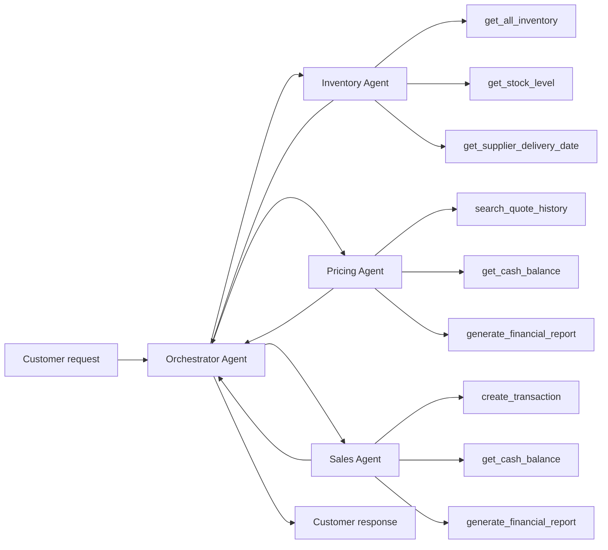

# Workflow diagram

## Agent responsibilities
- Orchestrator Agent: receives the customer request, delegates responsibilities, validates feasibility, and summarizes the final customer response.
- Inventory Agent: checks stock levels, compares requested quantities against available inventory, and estimates supplier lead times.
- Pricing Agent: uses search history and business logic to compute quoted prices and discounts while checking the current cash situation.
- Sales Agent: records accepted sales and stock-order transactions, updating the business ledger and financial position.

## Data flow
- Customer inquiries enter the orchestrator.
- The inventory agent validates product availability and delivery feasibility.
- The pricing agent calculates price and discounts.
- The sales agent records final transactions and updates the financial view.
- The orchestrator returns an explainable response to the client, with justification for rejections or restocks.
