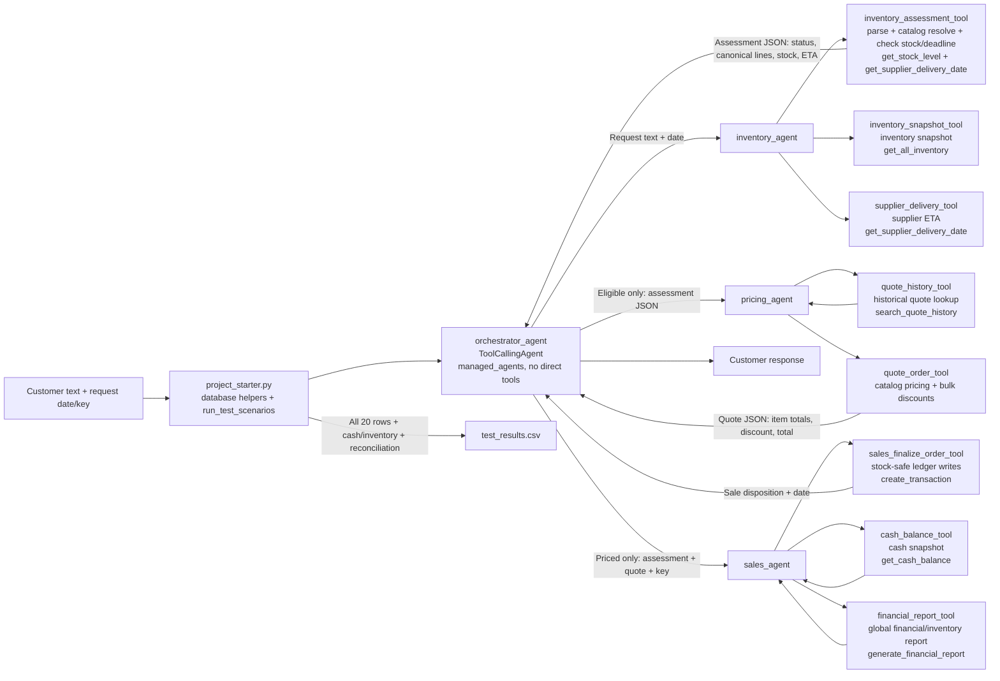

# Course Starter + Template Agent Workflow

`project_starter.py` owns the supplied database helpers and scenario runner. It passes those helper functions to `template.py`, where the three specialist workers and `orchestrator_agent` are defined. The orchestrator has no direct business tools and delegates the request in order.

```mermaid
flowchart LR
    C[Customer text + request date/key] --> S[project_starter.py<br/>database helpers + run_test_scenarios]
    S --> O[orchestrator_agent<br/>ToolCallingAgent<br/>managed_agents, no direct tools]

    O -->|Request text + date| I[inventory_agent]
    I --> IT1[inventory_assessment_tool<br/>parse + catalog resolve + check stock/deadline<br/>get_stock_level + get_supplier_delivery_date]
    I --> IT2[inventory_snapshot_tool<br/>inventory snapshot<br/>get_all_inventory]
    I --> IT3[supplier_delivery_tool<br/>supplier ETA<br/>get_supplier_delivery_date]
    IT1 -->|Assessment JSON: status, canonical lines, stock, ETA| O

    O -->|Eligible only: assessment JSON| P[pricing_agent]
    P --> PT1[quote_history_tool<br/>historical quote lookup<br/>search_quote_history]
    P --> PT2[quote_order_tool<br/>catalog pricing + bulk discounts]
    PT1 --> P
    PT2 -->|Quote JSON: item totals, discount, total| O

    O -->|Priced only: assessment + quote + key| A[sales_agent]
    A --> AT1[sales_finalize_order_tool<br/>stock-safe ledger writes<br/>create_transaction]
    A --> AT2[cash_balance_tool<br/>cash snapshot<br/>get_cash_balance]
    A --> AT3[financial_report_tool<br/>global financial/inventory report<br/>generate_financial_report]
    AT1 -->|Sale disposition + date| O
    AT2 --> A
    AT3 --> A

    O --> R[Customer response]
    S -->|All 20 rows + cash/inventory + reconciliation| T[test_results.csv]
```

## Tool ownership and helper mapping

| Worker | Configured tool | Purpose and starter helper |
|---|---|---|
| Inventory | `inventory_assessment_tool` | Normalize each customer line, distinguish unsupported items, validate stock and delivery. Uses `get_stock_level` and `get_supplier_delivery_date`. |
| Inventory | `inventory_snapshot_tool` | Read all positive stock. Uses `get_all_inventory`. |
| Inventory | `supplier_delivery_tool` | Estimate supplier lead time. Uses `get_supplier_delivery_date`. |
| Pricing | `quote_history_tool` | Find comparable prior requests and quotes. Uses `search_quote_history`. |
| Pricing | `quote_order_tool` | Apply catalog prices and quantity discounts to normalized lines. |
| Sales | `sales_finalize_order_tool` | Record order costs, supplier receipts, and item sales after stock/deadline validation. Uses `create_transaction`. |
| Sales | `cash_balance_tool` | Read cash at a date. Uses `get_cash_balance`. |
| Sales | `financial_report_tool` | Read global cash, inventory valuation, assets, and top sales. Uses `generate_financial_report`. |

The orchestrator calls inventory first; rejected assessments do not proceed to pricing or sales. Accepted orders require a valid quote and pass through the sales finalizer. When a model key is absent, the deterministic path uses the same assessment, quote, and finalization functions for local regression tests.
