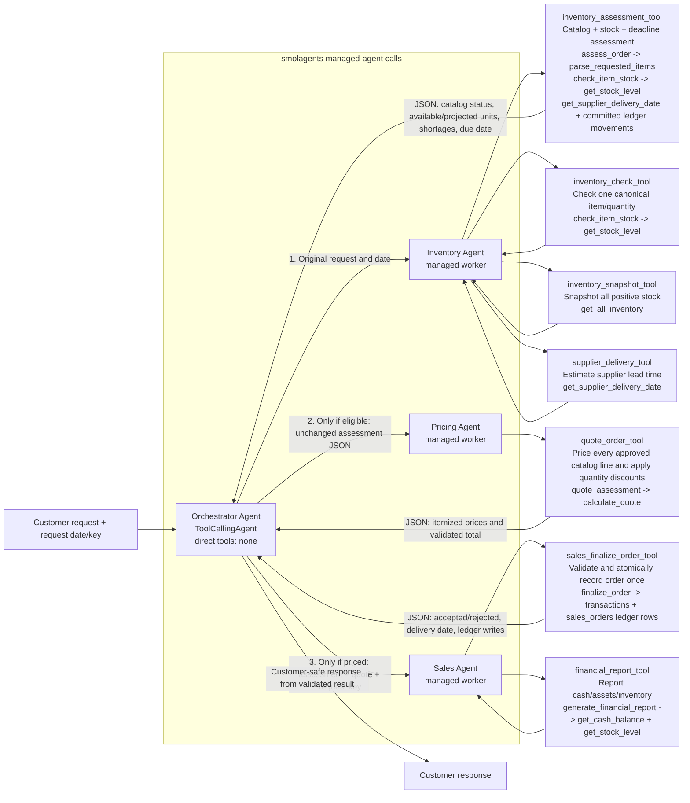

# Implemented Managed-Agent Workflow

The `orchestrator_agent` has **no direct business tools**. It manages the three specialist `ToolCallingAgent` instances through smolagents' `managed_agents` mechanism and invokes them in sequence. A rejected inventory assessment stops the sequence; an eligible request proceeds through pricing and sales.

```mermaid
flowchart LR
    C[Customer request + request date/key] --> O[Orchestrator Agent<br/>ToolCallingAgent<br/>direct tools: none]

    O -->|1. Original request and date| I[Inventory Agent<br/>managed worker]
    I --> IT1[inventory_assessment_tool<br/>Catalog + stock + deadline assessment<br/>assess_order -> parse_requested_items<br/>check_item_stock -> get_stock_level<br/>get_supplier_delivery_date + committed ledger movements]
    I --> IT2[inventory_check_tool<br/>Check one canonical item/quantity<br/>check_item_stock -> get_stock_level]
    I --> IT3[inventory_snapshot_tool<br/>Snapshot all positive stock<br/>get_all_inventory]
    I --> IT4[supplier_delivery_tool<br/>Estimate supplier lead time<br/>get_supplier_delivery_date]
    IT1 -->|JSON: catalog status, available/projected units, shortages, due date| O
    IT2 --> I
    IT3 --> I
    IT4 --> I

    O -->|2. Only if eligible: unchanged assessment JSON| P[Pricing Agent<br/>managed worker]
    P --> PT[quote_order_tool<br/>Price every approved catalog line and apply quantity discounts<br/>quote_assessment -> calculate_quote]
    PT -->|JSON: itemized prices and validated total| O

    O -->|3. Only if priced: assessment + quote + request key| S[Sales Agent<br/>managed worker]
    S --> ST1[sales_finalize_order_tool<br/>Validate and atomically record order once<br/>finalize_order -> transactions + sales_orders ledger rows]
    S --> ST2[financial_report_tool<br/>Report cash/assets/inventory<br/>generate_financial_report -> get_cash_balance + get_stock_level]
    ST1 -->|JSON: accepted/rejected, delivery date, ledger writes| O
    ST2 --> S

    O -->|Customer-safe response from validated result| R[Customer response]

    subgraph Framework[smolagents managed-agent calls]
        O
        I
        P
        S
    end
```

## Tool ownership and purpose

| Agent | Configured tool | Purpose and source helper(s) |
|---|---|---|
| Inventory | `inventory_assessment_tool` | Parses each requested line, distinguishes unsupported products, checks current/projected stock, and verifies delivery feasibility. Uses `assess_order`, `parse_requested_items`, `check_item_stock`, `get_stock_level`, and `get_supplier_delivery_date`. |
| Inventory | `inventory_check_tool` | Checks one catalog item's stock for a requested quantity. Uses `check_item_stock` and `get_stock_level`. |
| Inventory | `inventory_snapshot_tool` | Returns positive stock by catalog item. Uses `get_all_inventory`. |
| Inventory | `supplier_delivery_tool` | Estimates supplier lead time. Uses `get_supplier_delivery_date`. |
| Pricing | `quote_order_tool` | Prices every approved line using the catalog discount policy. Uses `quote_assessment` and `calculate_quote`. |
| Sales | `sales_finalize_order_tool` | Verifies the assessment/quote total and atomically records purchase, receipt, sale, and idempotency rows. Uses `finalize_order`. |
| Sales | `financial_report_tool` | Returns a financial and inventory snapshot. Uses `generate_financial_report`, `get_cash_balance`, and `get_stock_level`. |

The model coordinates work and creates language summaries; catalog resolution, stock/deadline eligibility, prices, and ledger writes are validated by deterministic application code. Unsupported goods are not represented as zero-stock catalog products.
